# 🏗️ Guddu-Project: High-Level Architecture

## System Architecture Overview

```mermaid
graph TB
    subgraph "Client Layer"
        WEB[Next.js Web App<br/>Premium UI/UX]
        MOBILE[React Native Mobile<br/>Event Operations]
        EMBED[Embeddable Widgets<br/>Public Dashboards]
    end

    subgraph "API Gateway & Load Balancing"
        NGINX[NGINX Ingress]
        LB[Load Balancer]
        APIGW[API Gateway<br/>Rate Limiting, Auth]
    end

    subgraph "Application Layer (NestJS)"
        AUTH[Auth Service<br/>JWT, OAuth2, RBAC]
        CONTENT[Content Service<br/>CRUD, Versioning]
        PUBLISH[Publishing Service<br/>Multi-Platform]
        MEDIA[Media Service<br/>Video Processing]
        ANALYTICS[Analytics Service<br/>Real-time Metrics]
        AI[AI/ML Service<br/>NLP, Vision, GPT]
        SOCIAL[Social Media Integrations<br/>FB, X, IG, YT, LI]
        WORKFLOW[Workflow Engine<br/>Approval Chains]
        NOTIF[Notification Service<br/>WebSocket, Email, SMS]
        SCHEDULE[Scheduler Service<br/>Queue Management]
    end

    subgraph "Data Layer"
        POSTGRES[(PostgreSQL<br/>Primary DB)]
        REDIS[(Redis<br/>Cache, Sessions)]
        ELASTIC[(Elasticsearch<br/>Full-text Search)]
        TIMESERIES[(TimescaleDB<br/>Analytics Data)]
    end

    subgraph "Storage Layer"
        S3[Object Storage<br/>AWS S3 / MinIO]
        CDN[CDN<br/>CloudFlare / Akamai]
    end

    subgraph "Message Queue & Events"
        KAFKA[Apache Kafka<br/>Event Streaming]
        BULLMQ[BullMQ<br/>Job Queues]
    end

    subgraph "AI/ML Infrastructure"
        ML_API[OpenAI / Azure OpenAI]
        EMBEDDING[Vector DB<br/>Pinecone / Weaviate]
        SENTIMENT[Sentiment Analysis<br/>Custom Models]
    end

    subgraph "External Integrations"
        FB_API[Facebook Graph API]
        X_API[X/Twitter API v2]
        IG_API[Instagram Graph API]
        YT_API[YouTube Data API]
        LI_API[LinkedIn API]
        TRANSLATE[Translation API<br/>Google / DeepL]
    end

    subgraph "Observability"
        PROM[Prometheus]
        GRAFANA[Grafana]
        LOKI[Loki - Logs]
        SENTRY[Sentry - Error Tracking]
    end

    subgraph "Infrastructure"
        K8S[Kubernetes Cluster]
        DOCKER[Docker Containers]
        CICD[GitHub Actions CI/CD]
    end

    WEB --> NGINX
    MOBILE --> NGINX
    EMBED --> NGINX
    NGINX --> LB
    LB --> APIGW
    
    APIGW --> AUTH
    APIGW --> CONTENT
    APIGW --> PUBLISH
    APIGW --> MEDIA
    APIGW --> ANALYTICS
    APIGW --> WORKFLOW
    
    AUTH --> POSTGRES
    AUTH --> REDIS
    
    CONTENT --> POSTGRES
    CONTENT --> REDIS
    CONTENT --> ELASTIC
    CONTENT --> S3
    
    PUBLISH --> KAFKA
    PUBLISH --> SOCIAL
    PUBLISH --> REDIS
    
    MEDIA --> S3
    MEDIA --> KAFKA
    MEDIA --> CDN
    
    ANALYTICS --> TIMESERIES
    ANALYTICS --> REDIS
    ANALYTICS --> ELASTIC
    
    AI --> ML_API
    AI --> EMBEDDING
    AI --> SENTIMENT
    
    SOCIAL --> FB_API
    SOCIAL --> X_API
    SOCIAL --> IG_API
    SOCIAL --> YT_API
    SOCIAL --> LI_API
    
    WORKFLOW --> POSTGRES
    WORKFLOW --> KAFKA
    WORKFLOW --> NOTIF
    
    SCHEDULE --> BULLMQ
    SCHEDULE --> KAFKA
    
    K8S --> DOCKER
    CICD --> K8S
    
    PROM --> GRAFANA
    LOKI --> GRAFANA
```



---

## Architecture Principles

### 1. **Microservices with Modular Monolith Hybrid**
- Start with modular monolith (NestJS modules)
- Easy path to microservices extraction as needed
- Shared database initially, event-driven communication

### 2. **Event-Driven Architecture**
- All critical state changes emit events to Kafka
- Enables real-time features, audit trails, and async processing
- Decouples services for scalability

### 3. **CQRS (Command Query Responsibility Segregation)**
- Write operations go through command handlers
- Read operations use optimized read models
- Analytics queries use TimescaleDB for time-series data

### 4. **Multi-Tenancy**
- Organization-level isolation
- Shared infrastructure, logical data separation
- Row-level security in PostgreSQL

### 5. **Zero-Trust Security**
- Every request authenticated and authorized
- Service-to-service mTLS
- Secrets managed via Vault/K8s Secrets
- Encrypted at rest and in transit

### 6. **Horizontal Scalability**
- Stateless application services
- Can scale to 100+ pods under load
- Auto-scaling based on CPU/memory/queue depth

### 7. **Real-Time First**
- WebSocket connections for live updates
- Server-Sent Events (SSE) for dashboard streaming
- Sub-second latency for critical operations

---

## Technology Stack Deep Dive

### Backend Framework: **NestJS** (TypeScript)
**Why NestJS?**
- Enterprise-grade architecture out of the box
- Built-in dependency injection
- Excellent TypeScript support
- Modular and testable
- Strong ecosystem (Prisma, TypeORM, GraphQL)

**Alternative**: FastAPI (Python) - considered but Node.js better for real-time features

### Database: **PostgreSQL 16**
- Robust ACID compliance
- JSON/JSONB support for flexible schemas
- Row-level security for multi-tenancy
- PostGIS for geo-spatial features
- Full-text search capabilities

### Cache: **Redis 7**
- Session storage
- Real-time leaderboards and counters
- Pub/Sub for WebSocket broadcasting
- Rate limiting

### Search: **Elasticsearch 8**
- Full-text search across content
- Hashtag and mention indexing
- Log aggregation
- Real-time analytics

### Time-Series: **TimescaleDB**
- Built on PostgreSQL
- Optimized for analytics queries
- Continuous aggregates for dashboards
- Retention policies

### Message Queue: **Apache Kafka + BullMQ**
- Kafka: Event streaming, audit logs, analytics pipeline
- BullMQ: Job queue for retries, scheduling, background tasks

### Object Storage: **AWS S3 / MinIO**
- Media files (images, videos)
- User uploads
- Generated reports
- Backup storage

### CDN: **CloudFlare**
- Global edge caching
- DDoS protection
- Image optimization
- Video streaming

### Frontend: **Next.js 14 + React 18**
- App Router for modern routing
- Server-side rendering for SEO
- Streaming and suspense
- Edge runtime support

### Styling: **Tailwind CSS + Shadcn/ui**
- Utility-first CSS
- Premium component library
- Dark mode support
- Responsive by default

### AI/ML Stack**
- **OpenAI GPT-4**: Content generation, captions
- **Azure Computer Vision**: Image analysis, OCR
- **Hugging Face Transformers**: Sentiment analysis
- **Pinecone**: Vector embeddings for semantic search
- **FFmpeg**: Video processing pipeline

### Observability**
- **Prometheus**: Metrics collection
- **Grafana**: Dashboards and alerting
- **Loki**: Log aggregation
- **Sentry**: Error tracking and performance monitoring
- **OpenTelemetry**: Distributed tracing

### Infrastructure**
- **Kubernetes**: Container orchestration
- **Docker**: Containerization
- **Helm**: K8s package management
- **GitHub Actions**: CI/CD pipelines
- **Terraform**: Infrastructure as code

---

## Security Architecture

### Authentication & Authorization
```
┌─────────────────────────────────────────────────────┐
│                 User Login Request                   │
└──────────────────┬──────────────────────────────────┘
                   │
                   ▼
         ┌─────────────────────┐
         │   Auth Service      │
         │   (JWT + OAuth2)    │
         └──────────┬──────────┘
                    │
         ┌──────────┴──────────┐
         │                     │
         ▼                     ▼
┌─────────────────┐   ┌─────────────────┐
│  Local Auth     │   │  OAuth Providers│
│  (bcrypt hash)  │   │  (Google, MS)   │
└────────┬────────┘   └────────┬────────┘
         │                     │
         └──────────┬──────────┘
                    │
                    ▼
         ┌─────────────────────┐
         │   Generate JWT      │
         │   - Access Token    │
         │   - Refresh Token   │
         └──────────┬──────────┘
                    │
                    ▼
         ┌─────────────────────┐
         │   RBAC Middleware   │
         │   Check Permissions │
         └─────────────────────┘
```

### Data Encryption
- **At Rest**: AES-256 encryption for sensitive fields
- **In Transit**: TLS 1.3 for all connections
- **Database**: Transparent Data Encryption (TDE)
- **Secrets**: HashiCorp Vault / K8s Secrets

### Audit Logging
Every critical action logged:
- Who did what, when, where
- IP address, user agent, location
- Before/after state for changes
- Immutable audit trail in Kafka

### Compliance
- **GDPR**: Data portability, right to deletion
- **SOC 2 Type II**: Security controls
- **ISO 27001**: Information security management
- **Government IT Policy**: India-specific requirements

---

## Scalability & Performance

### Horizontal Scaling Targets
- **Application Pods**: 3-100+ replicas
- **Database**: Read replicas (5+), connection pooling
- **Redis**: Cluster mode (6+ nodes)
- **Kafka**: 3+ brokers, partition replication

### Performance SLAs
- **API Response Time**: p95 < 200ms
- **Dashboard Load**: < 2s (First Contentful Paint)
- **Content Publishing**: < 3s end-to-end
- **Real-time Updates**: < 500ms latency
- **Video Processing**: < 1min for 1080p 60s clip
- **Uptime**: 99.99% (4.38 min downtime/month)

### Load Testing Targets
- **Concurrent Users**: 10,000+
- **API Requests**: 50,000 req/sec peak
- **WebSocket Connections**: 100,000 concurrent
- **Media Uploads**: 1,000/min
- **Database Writes**: 10,000 writes/sec

---

## Disaster Recovery & Business Continuity

### Backup Strategy
- **Database**: Point-in-time recovery (30 days)
- **Media Files**: S3 versioning + cross-region replication
- **Configurations**: GitOps, version controlled

### High Availability
- **Multi-AZ Deployment**: 3 availability zones
- **Active-Active**: Traffic distributed globally
- **Failover**: Automatic, < 30s RTO
- **Data Loss**: RPO < 5 minutes

### Incident Response
- **Monitoring**: 24/7 on-call rotation
- **Alerting**: PagerDuty integration
- **Runbooks**: Automated remediation where possible
- **Post-Mortems**: Blameless, actionable

---

## Development & Deployment Pipeline

```
┌──────────────┐
│  Developer   │
│  Commits     │
└──────┬───────┘
       │
       ▼
┌──────────────────┐
│  GitHub Actions  │
│  - Lint          │
│  - Test          │
│  - Build         │
└──────┬───────────┘
       │
       ▼
┌──────────────────┐
│  Docker Build    │
│  - Multi-stage   │
│  - Optimized     │
└──────┬───────────┘
       │
       ▼
┌──────────────────┐
│  Push to Registry│
│  - ECR/Harbor    │
└──────┬───────────┘
       │
       ├──────────────┬──────────────┐
       │              │              │
       ▼              ▼              ▼
┌──────────┐   ┌──────────┐   ┌──────────┐
│   DEV    │   │ STAGING  │   │   PROD   │
│  Auto    │   │  Manual  │   │  Manual  │
└──────────┘   └──────────┘   └──────────┘
```

### Environments
1. **Development**: Auto-deploy on merge to `develop`
2. **Staging**: Production mirror, manual promotion
3. **Production**: Blue-green deployment, manual approval

### CI/CD Best Practices
- Automated testing (unit, integration, e2e)
- Security scanning (Snyk, Trivy)
- Performance benchmarks
- Database migrations (automated)
- Rollback capability (< 5 min)

---

*Architecture for the next decade of digital diplomacy* 🏛️

