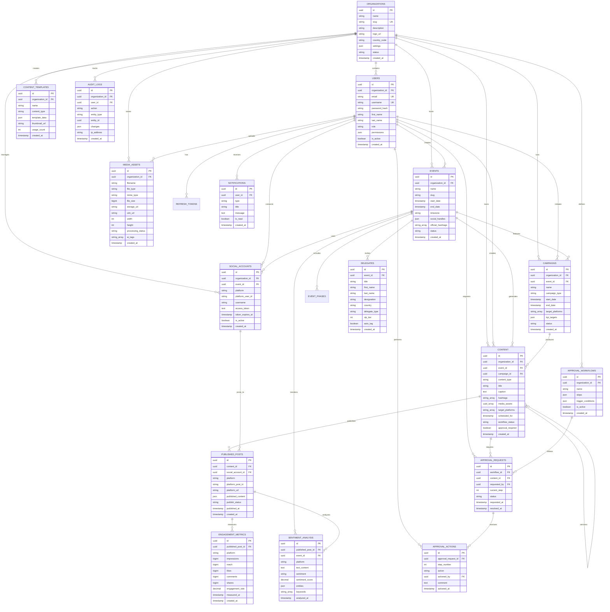

# 📊 Entity Relationship Diagram (ERD)

## Guddu-Project Database Schema

---

## Schema Statistics

### Total Tables: 22

#### Core Domain (8 tables)
- Organizations
- Users
- Events
- Delegates
- Campaigns
- Content
- Media Assets
- Content Templates

#### Social Media (3 tables)
- Social Accounts
- Published Posts
- Engagement Metrics

#### Analytics & Intelligence (1 table)
- Sentiment Analysis

#### Workflow & Governance (3 tables)
- Approval Workflows
- Approval Requests
- Approval Actions

#### System (4 tables)
- Notifications
- Audit Logs
- Refresh Tokens
- Event Phases

---

## Key Relationships

### One-to-Many Relationships
- **Organization → Users**: 1:N (Multi-tenancy)
- **Organization → Events**: 1:N
- **Event → Delegates**: 1:N
- **Event → Campaigns**: 1:N
- **Campaign → Content**: 1:N
- **Content → Published Posts**: 1:N
- **Published Post → Engagement Metrics**: 1:N
- **Approval Request → Approval Actions**: 1:N

### Self-Referential Relationships
- **Content → Content**: Version history (parent-child)

### Optional Relationships (SetNull on Delete)
- **Campaign.event_id**: Optional (campaigns can exist without events)
- **Content.event_id**: Optional
- **Content.campaign_id**: Optional
- **ApprovalRequest.workflow_id**: Optional (manual approvals)

---

## Data Modeling Principles

### 1. **Multi-Tenancy**
- Every major entity links to `organization_id`
- Row-level security enforced at application layer
- Logical data isolation

### 2. **Soft Deletes**
- Major entities have `deleted_at` timestamp
- Enables data recovery and audit compliance
- Physical deletion for GDPR compliance when requested

### 3. **Audit Trail**
- Every write operation logged to `audit_logs`
- Immutable historical record
- Supports compliance and debugging

### 4. **Versioning**
- Content has version control via `parent_version_id`
- Enables rollback and change tracking
- Approval history preserved

### 5. **Flexibility**
- JSONB columns for extensibility (`settings`, `metadata`)
- Array columns for tags, hashtags, platforms
- Supports evolving requirements without schema migrations

### 6. **Time-Series Optimization**
- Engagement metrics partitioned by time (TimescaleDB)
- Fast queries for dashboards
- Efficient aggregations

### 7. **Security**
- Passwords bcrypt hashed
- OAuth tokens encrypted at rest
- IP addresses and user agents logged
- Two-factor authentication support

---

## Indexing Strategy

### Primary Indexes
- UUID primary keys on all tables (clustered)
- Foreign key indexes automatically created

### Performance Indexes
- **Users**: email, organization_id, role, is_active
- **Events**: slug, status, dates
- **Content**: workflow_status, scheduled_for, organization_id
- **Published Posts**: platform, publish_status
- **Engagement Metrics**: measured_at (time-series)
- **Notifications**: user_id, is_read, created_at

### Full-Text Search Indexes
- Content: title + body + caption (GIN index)
- Delegates: name + designation + organization (GIN index)

### Composite Indexes
- `(organization_id, slug)` on Events (unique)
- `(organization_id, platform, platform_user_id)` on Social Accounts (unique)
- `(entity_type, entity_id)` on Audit Logs

---

## Scalability Considerations

### Partitioning Strategy
- **Engagement Metrics**: Partition by time (monthly)
- **Sentiment Analysis**: Partition by time (monthly)
- **Audit Logs**: Partition by time (quarterly)

### Read Replicas
- Analytics queries → Read replica
- Dashboard queries → Read replica
- Transactional writes → Primary

### Caching Strategy
- User sessions → Redis
- Content drafts → Redis (TTL 1 hour)
- Engagement metrics → Redis (TTL 5 minutes)
- Social account tokens → Redis (secure)

### Archive Strategy
- Engagement metrics older than 2 years → Cold storage (S3)
- Audit logs older than 5 years → Archive
- Deleted content after 90 days → Permanent deletion (GDPR)

---

*Database designed for planetary scale* 🌍

